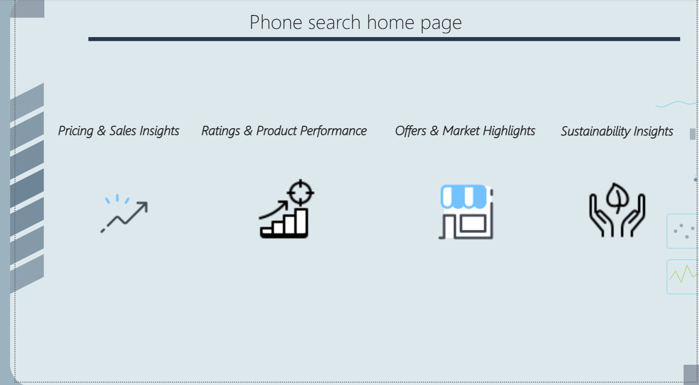
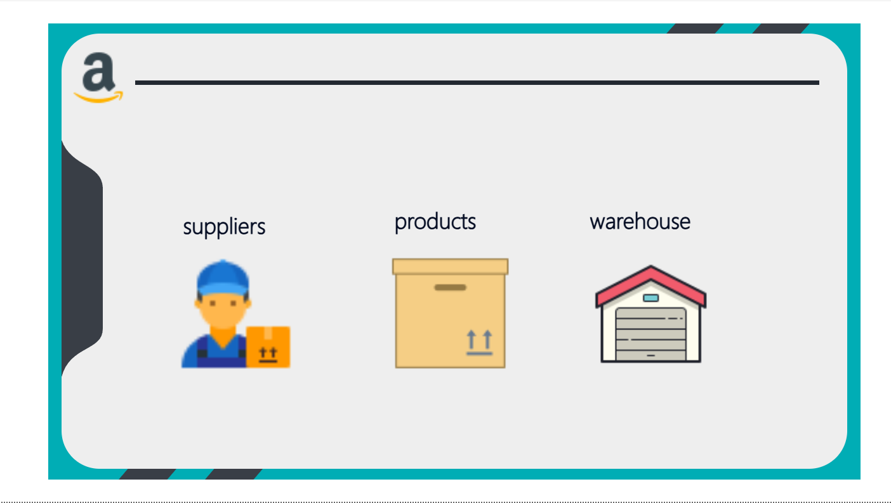
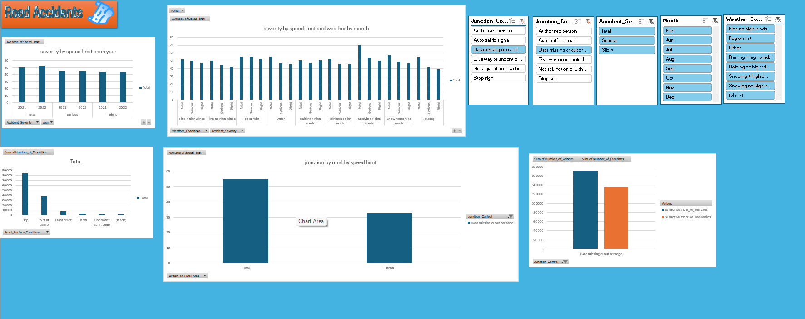

# Data Analytics Portfolio 📊
A collection of data analysis and visualization projects demonstrating ETL processes, statistical modeling, and interactive dashboard creation.

## 🛠️ Tools & Technologies
* **Visualizations:** Power BI, Tableau
* **Spreadsheets:** Excel (Advanced formulas, Pivot Tables)
* **Programming:** Python (Pandas, NumPy, Matplotlib)
* **Database:** SQL

## 📂 Projects Included

### 1. Power BI Dashboards

#### 📱 Phone Search Analytics
Interactive dashboard analyzing phone search data and trends.

*(See Phone-Search-Analytics folder for more screenshots)*

#### 📦 Amazon Data Visualization
Deep dive into Amazon product data and consumer behavior.

*(See Amazon-Data-Analysis folder for more screenshots)*

#### 🛒 Sales Metrics Dashboard
Visualization of key performance indicators (KPIs) and retail metrics.

### 2. Excel Analytics & Statistical Modeling

#### 🚗 Road Accident Data Analysis
Statistical report analyzing factors contributing to road accidents.

#### 🎬 IMDB Dataset Analysis
Data visualization and statistical modeling of movie ratings and trends.
